  

 

  &nbsp;
  &nbsp;
  &nbsp;
  

  

<h3 align="center"><samp>research</samp></h3>

<table align="center">
  <tr>
    <td><samp>vr&nbsp;×&nbsp;cognition</samp></td>
    <td>Unity VR simulators for behavioural research at the ACS Lab, IIT Mandi - co-author of a paper accepted at <b>PETRA 2026</b>, Crete</td>
  </tr>
  <tr>
    <td><samp>robots&nbsp;×&nbsp;autonomy</samp></td>
    <td><a href="https://github.com/CodeKunalTomar/autonomous-gps-denied-drone-navigation">GPS-denied UAV navigation</a> at the CIR, IIIT Allahabad · <a href="https://github.com/CodeKunalTomar/multi_robot_coordination_system">dual 7-DOF arm coordination</a> in PyBullet</td>
  </tr>
  <tr>
    <td><samp>ml&nbsp;×&nbsp;rigor</samp></td>
    <td>leakage-controlled evaluation on multimodal EEG + HRV data · <a href="https://github.com/CodeKunalTomar/fa-ucb">bandits with untrusted change forecasts</a>, in progress</td>
  </tr>
  <tr>
    <td><samp>play</samp></td>
    <td><a href="https://github.com/CodeKunalTomar/OptiConnect">OptiConnect</a> - Connect-4 minimax that thinks in a Web Worker · <a href="https://opticonnect.vercel.app">live</a></td>
  </tr>
</table>

  

<h3 align="center"><samp>tools</samp></h3>

  

  

<h3 align="center"><samp>activity</samp></h3>

  
  

 

  <picture>
    <source media="(prefers-color-scheme: dark)" srcset="https://raw.githubusercontent.com/CodeKunalTomar/CodeKunalTomar/output/github-snake-dark.svg" />
    <source media="(prefers-color-scheme: light)" srcset="https://raw.githubusercontent.com/CodeKunalTomar/CodeKunalTomar/output/github-snake.svg" />
    
  </picture>

  

  <samp>hand-coded svg animations · no template</samp>

